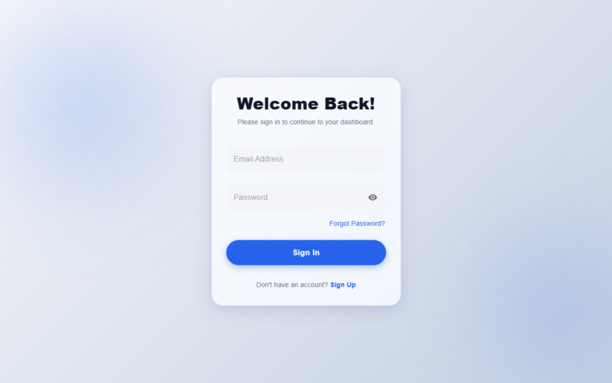
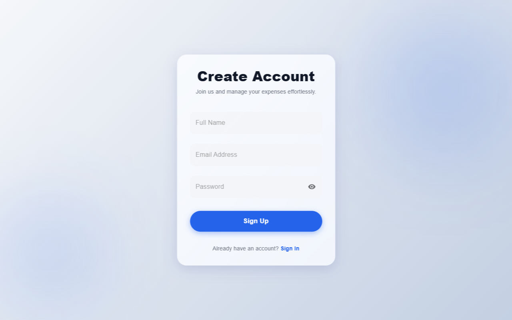
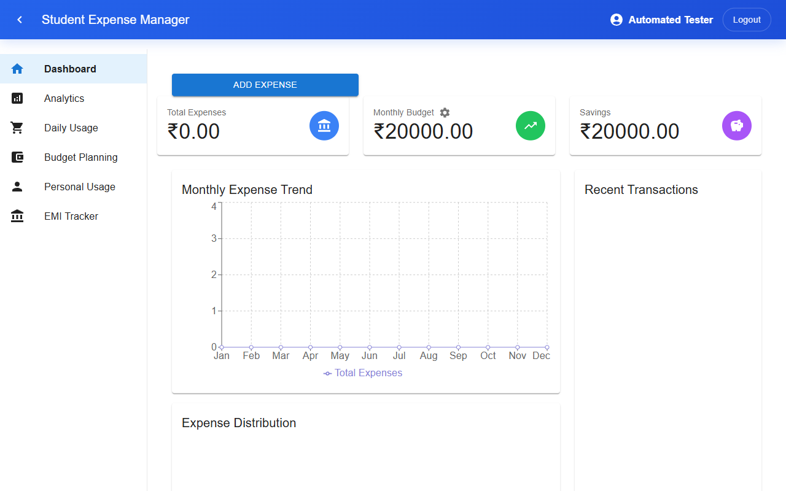
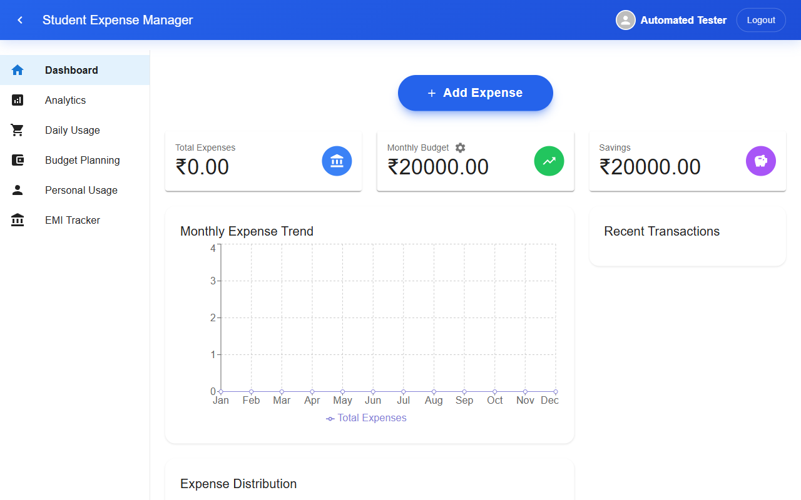

# Student Expense Manager 🎓💰
**Current Project Status - January 24, 2026**

This document tracks the current state of the Student Expense Manager application. It serves as a baseline to understand existing features, the user interface, and functional capabilities before further development.

---

## 🚀 Key Features Overview

### 1. Authentication & Security
**Current State:** Fully implemented.
- **Login Page:** Allows users to sign in.
- **Signup Page:** Registration for new users.
- **Security:** Routes are protected; users cannot access the dashboard without logging in. unauthenticated users are redirected to `/login`.


*Login Page Interface*


*Signup Page Interface*

---

### 2. Dashboard (Home)
**Current State:** The central hub of the application.
- **Overview Cards:** Displays key metrics like Total Budget, Total Expenses, and Remaining Balance.
- **Expense Distribution:** Visual breakdown of expenses (likely a Pie Chart).
- **Monthly Trend:** A graph showing spending changes over time.
- **Recent Transactions:** A list of the latest expenses added by the user.


*Dashboard showing real-time overview and charts*

---

### 3. Daily Usage
**Current State:** For tracking day-to-day spending.
- **Add Expense Form:** Interface to input new expenses (Amount, Category, Date, etc.).
- **Expense List:** Detailed history of all entered expenses.
- **Edit/Delete:** Users can modify existing entries via a modal.
- **Calculator:** Built-in tool for quick calculations while adding expenses.
- **Category Summary:** aggregated view of spending by category.


*Daily Usage Tracking Interface*

---

### 4. Analytics & Reports
**Current State:** Deep dive into spending habits.
- **Spending Trends:** Visual analysis of where money is going.
- **Monthly Analysis:** Breakdown of expenses on a month-by-month basis.
- **Export Options:** Capabilities to export data (likely to PDF or Excel) for offline viewing.


*Analytics and Trends Page*

---

### 5. AI Budget Planning (GenAI Integration) 🤖
**Current State:** Advanced feature powered by **Google Gemini 2.0 Flash**.
- **Functionality:** Users enter their financial profile (Income, Goal, Location, Habits).
- **AI Engine:** The app sends this data to Gemini via `ChatGPTService.js`.
- **Output:** Returns a personalized, structured budget plan including:
  - Recommended fixed expenses vs. savings.
  - Investment advice.
  - Custom tips based on the user's city/location.


*AI Budget Planning Interface*

---

### 6. Future Modules (Placeholders)
These sections are present in the routing but currently marked as "Coming Soon":
- **Personal Usage:** `[Coming Soon]`
- **EMI Tracker:** `[Coming Soon]`

---

## 🛠 Technical Stack
- **Frontend:** React.js
- **UI Framework:** Material UI (MUI)
- **Styling:** Tailwind CSS + Custom CSS
- **Charts:** Recharts
- **PDF/Exports:** jsPDF, xlsx
- **Icons:** MUI Icons, FontAwesome
- **AI/LLM:** Google Gemini API (via `generativelanguage.googleapis.com`)
- **Routing:** React Router DOM v6+

---

## 🏃‍♂️ How to Run

1. **Install Dependencies:**
   ```bash
   npm install
   ```

2. **Start the Application:**
   ```bash
   npm start
   ```
   *Runs on `http://localhost:3000` (or 3001 if 3000 is busy).*

3. **Build for Production:**
   ```bash
   npm run build
   ```

---
*Documentation generated by Antigravity on 2026-01-24.*
